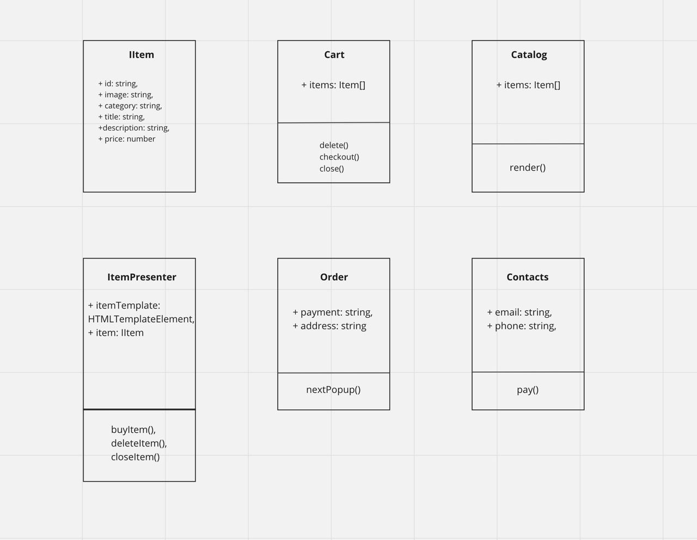

# Проектная работа "Веб-ларек"

Стек: HTML, SCSS, TS, Webpack

Структура проекта:
- src/ — исходные файлы проекта
- src/components/ — папка с JS компонентами
- src/components/base/ — папка с базовым кодом

Важные файлы:
- src/pages/index.html — HTML-файл главной страницы
- src/types/index.ts — файл с типами
- src/index.ts — точка входа приложения
- src/scss/styles.scss — корневой файл стилей
- src/utils/constants.ts — файл с константами
- src/utils/utils.ts — файл с утилитами

## Установка и запуск
Для установки и запуска проекта необходимо выполнить команды

```
npm install
npm run start
```

или

```
yarn
yarn start
```
## Сборка

```
npm run build
```

или

```
yarn build
```
Базовый код

### ТИПЫ ДАННЫХ

/* Возможные типы данных для категорий товаров */
export type CategoryType =
  | 'другое'
  | 'софт-скил'
  | 'дополнительное'
  | 'кнопка'
  | 'хард-скил';
 
 /* Интерфейс, описывающий корзину */
export interface IBasket {
  items: IItem[];
}

/* Интерфейс, описывающий окно контакты */
export interface IContacts {
    phone: string;
    email: string;
}

/* Интерфейс, описывающий карточку товара */
export interface IItem {
    id: string;
    image: string;
    category: CategoryType;
    title: string;
    description: string;
    price: number | null;
}

/* Интерфейс, описывающий конечный заказ */
export interface IOrder {
    total: number;
}

/* Интерфейс, описывающий окно заказ */
export interface IPayment {
    address: string;
    payment: Payment;
}

/* Тип для состояния кнопок выбора оплаты */
enum Payment {Online, Receipt};
### Модели данных

/* Абстрактный класс для модели */
export abstract class Model<T> {
    protected data: T

    constructor(data: T) {
        this.data = data
    }
}
/* Абстрактный класс для вьюшки */
export abstract class View {
    protected _element: HTMLElement

    constructor(element: HTMLElement) {
        this._element = element
    }

    get element(): HTMLElement {
        return this._element
    }
}

### Классы

/* Класс описывающий модель корзины, с геттером получения товаров, находящихся в корзине, методом deleteItem для удаления товаров, addItem - для добавления, clear - для очистки корзины, когда заказ успешно оформлен*/
 export class BasketModel extends Model <IBasket> {

  constructor(data: IBasket) {
    super(data)
  }
  
  get items() {
    return this.data.items
  }
  
  public deleteItem(itemId: string) {
    let index = this.data.items.findIndex((item) => item.id === itemId)
    if (index == -1) {
      return
    } else {
      this.items.splice(index,1);
    }
  }

  public addItem(item:IItem) {
    this.items.unshift(item);
  }

  public clear () {
    this.items.splice(0,this.items.length);
  }
}

/* Класс описывающий модель формы заполнения контактов покупателя, геттеры и сеттеры для получения телефона и мэйла, а также для их изменения*/
    export class ContactsModel extends Model <IContacts> {

    constructor(data: IContacts) {
        super(data)
    }

    get phone() {
        return this.data.phone
    }

    set phone(value: string) {
        this.data.phone = value;
    }

    get email() {
        return this.data.email
    }
    
    set email(value: string) {
        this.data.email = value;
    }
}

/* Класс описывающий модель карточки товара, с геттерами для получения контента в каждом свойстве*/
    export class ItemModel extends Model<IItem> {
    
    constructor(data: IItem) {
        super(data)
    }
    
    get id():string {
        return this.data.id
    } // геттер для получения ID
    get title():string {
        return this.data.title
    } // геттер для получения заголовка
    get image():string {
        return this.data.image
    }// геттер для получения картинки
    get category():string {
        return this.data.category
    }// геттер для получения категории
    get price():number {
        return this.data.price
    } // геттер для получения цены
    get description():string {
        return this.data.description
    }// геттер для получения описания
}

/* Класс модели завершенного заказа, с геттером и сеттеров итоговой суммы заказа */
export class OrderModel extends Model <IOrder> {

    constructor(data: IOrder) {
        super(data)
    }

    get total() {
        return this.data.total
    }
    set total(value: number) {
        this.data.total = value
    }
}

/* Класс модели формы выбора оплаты заказа и адреса покупателя, геттеры и сеттеры для получения адреса и метода оплаты, а также для их изменения*/
    export class PaymentModel extends Model <IPayment> {

    constructor(data: IPayment){
        super(data)
    }

    get address() {
        return this.data.address
    }

    set address(value: string) {
        this.data.address = value;
    }

    get payment() {
        return this.data.payment
    }
    
    set payment(value: Payment) {
        this.data.payment = value;
    }
}

/* Класс вью для отображения корзины*/
export class BasketView extends View {
    constructor(element: HTMLElement) {
        super(element)
    }
}

/* Класс вью для отображения контактов покупателя*/
export class ContactsView extends View {
    constructor(element: HTMLElement) {
        super(element)
    }
}

/* Класс вью для отображения товаров*/
export class ItemView extends View {
    constructor(element: HTMLElement) {
        super(element)
    }
}

/* Класс вью для отображения завершенного попапа с заказом*/
export class OrderView extends View {
    constructor(element: HTMLElement) {
        super(element)
    }
}

/* Класс вью для отображения оплаты заказа*/
export class PaymentView extends View {
    constructor(element: HTMLElement) {
        super(element)
    }
}


